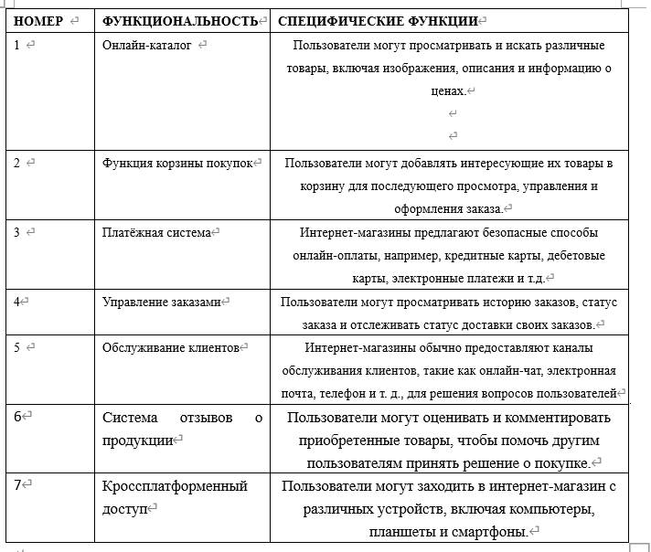

 # **Хань Фэн Яа Юнь（汉风雅韵）**
 

## **Содержание**
- [Обзор](#обзор)
  - [О названии](#о-названии)
  - [Цели создания интернет-магазина](#Цели-создания-интернет-магазина)
- [Целевая архитектура](#Целевая-архитектура)
- [Системные требования для открытия интернет-магазина](#системные-требования-для-открытия-интернет-магазина)
  - [Платформа для электронной коммерции](#платформа-для-электронной-коммерции)
  - [Фотосъемка и украшение товара](#фотосъемка-и-украшение-товара)
  - [Логистика и дистрибуция](#логистика-и-дистрибуция)
  - [Обслуживание клиентов](#обслуживание-клиентов)
  - [Маркетинговое продвижение](#маркетинговое-продвижение)
- [Работа интернет-магазина](#работа-интернет-магазина)
  - [Предварительная подготовка](#предварительная-подготовка)
  - [Обслуживание клиентов и послепродажное обслуживание](#обслуживание-клиентов-и-послепродажное-обслуживание)
  - [Анализ и корректировка данных](#анализ-и-корректировка-данных)
  - [Складирование и логистика](#складирование-и-логистика)
  - [Атрибуты качества](#атрибутыкачества)

## **Обзор**
### **О названии**
Выбор ***"Хань Фэн Яа Юнь"*** в качестве названия этого китайского интернет-магазина не только отражает уважение и любовь к традиционной китайской культуре, но и желание продвигать китайскую культуру в мире через такой интернет-магазин, надеясь предоставить покупателям не только товары, но и культурный опыт и удовольствие. Название не только уникально, но и многозначительно, что позволяет легко привлечь покупателей, интересующихся китайской культурой.  
> Название ***"Хань Фэн"*** олицетворяет традиционную китайскую культуру, представленную "культурой Хань". Использование "Хань Фэн" в названии призвано показать характеристики товаров, продаваемых в магазине, а также дать людям ощущение старомодной элегантности.
> ***"Яа Юнь"*** олицетворяет элегантность и культурный колорит, передавая желание магазина приносить покупателям не только материальное удовлетворение, но и некое духовное наслаждение и культивацию.
### **Цели создания интернет-магазина**
Есть две основные цели открытия интернет-магазина: бизнес-цели и цели, приносящие ценность.
>Бизнес-цели в основном включают в себя следующие пункты:
>1. Наследование и продвижение китайской культуры. Продавая продукцию с традиционным китайским стилем и характеристиками, мы распространяем китайскую культуру во внешний мир и повышаем осведомленность и понимание людьми китайской культуры.
>2. Удовлетворение потребностей потребителей. В магазине представлен широкий выбор товаров в китайском стиле, включая одежду, продукты питания, поделки и т. д.
>3. Повысьте удовлетворенность клиентов. Стремимся обеспечить высокое качество обслуживания клиентов, включая удобный и быстрый процесс совершения покупок, внимательное обслуживание клиентов и послепродажную поддержку.

>Цели создания добавленной стоимости в основном включают в себя следующие пункты:
>1. Создание экономических выгод. Достигайте прибыльности, предоставляя уникальные продукты и услуги для получения экономической выгоды и привлечения большего количества клиентов.
>2. Инновационный дизайн и улучшение процесса. Стремится к инновационному дизайну и совершенствованию процессов, созданию продукции с китайскими характеристиками и высоким качеством, а также содействию развитию и модернизации отрасли.
### **Основные функции интернет-магазина** ###  

 
### **Внешний вид интернет-магазина**
>1. Oтображение главной страницы: ① Изысканный дизайн темы в китайском стиле, включающий традиционные китайские элементы, такие как красный цвет, дракон, феникс, китайский узел и т. д. ② Понятная панель навигации и распределение по категориям, чтобы пользователи могли быстро найти интересующие их товары.
>2. Страница подробной информации о продукте:① Четкие изображения товаров, подчеркивающие особенности традиционного китайского стиля, например, детали китайской одежды, узоры ремесленных изделий и т. д.② Подробные описания товаров, которые знакомят с материалом, размером, мастерством изготовления и другой информацией, чтобы пользователи могли четко понять ее.③ Простые в использовании опции покупки, включая функциональные кнопки для добавления в корзину, выбора характеристик, покупки сейчас и т. д., которые удобны для пользователей при оформлении заказов и совершении покупок.

Благодаря вышеописанному дизайну интернет-магазин способен передать очарование традиционной китайской культуры во время просмотра и совершения покупок, привлекая пользователей и повышая их удобство.

## **Целевая архитектура**
В этом разделе представлена ​​архитектура интернет-магазина.
### **Схема бизнес-процессов**
В процессе разработки карты бизнес-процессов с применением техники Event Storming для интернет-магазина китайских специализированных товаров целью является определение и визуализация ключевых событий, команд, и акторов, взаимодействующих в процессе выбора, покупки, доставки товара и обслуживания клиентов.
> Цель: Получить четкое представление о процессе онлайн-покупок с момента входа покупателя на сайт до момента получения товара.

> Участники: потребители, аналитики, маркетологи.

> Материалы: Разноцветные стикеры разных форм и большая поверхность для наклеивания

https://miro.com/app/board/uXjVKXw6SUQ=/

### **Таблица анализа стейкхолдера**  
Для интернет-магазинов важно проанализировать заинтересованные стороны. Заинтересованные стороны интернет-магазина - это потребители, акционеры, логистические компании, государство, поставщики и другие компании.  

### **Контекстная диаграмма интернет-магазина**
Следующая диаграмма контекста системы описывает ключевых пользователей системы и их внешние зависимости:

### **Прямые пользователи интернет-магазина**
На следующей UML-диаграмме изображены непосредственные пользователи интернет-магазина:

  

### **Истории пользователей（User Story）**  
Ниже представлены истории пользователей с точки зрения потребителей, продавцов и логистических компаний соответственно. Благодаря пользовательским историям можно лучше понять потребности пользователей с каждой точки зрения и преобразовать их в реализуемые функции.  

  
  
  

### **Нефункциональные требования в порядке приоритета**  
При разработке интернет-магазина китайских товаров важно уделять особое внимание не только функциональным, но и нефункциональным требованиям.Сосредоточьтесь на приоритетах, приоритетный список нефункциональных требований
Высокий приоритет
1. Безопасность
- Защита данных пользователей: шифрование данных пользователей и платежной информации в базе данных.
- Внедрите безопасную систему аутентификации и авторизации, включая многофакторную аутентификацию (MFA), где это необходимо.

2. Скорость и производительность
- Время загрузки страниц не должно превышать 3 секунд.Нормальная скорость загрузки информации с веб-сайта составляет 300-500 КБ.
- Оптимизация изображений и быстрая загрузка информации о продукте.
- Масштабируемость для обработки пиковых нагрузок, особенно во время распродаж и праздников, в периоды высокой посещаемости сайта потребителями.Магазин должен выдерживать нагрузку в 1000 посетителей онлайн одновременно.

3. Удобство использования
- Убедитесь, что контент доступен для людей с ограниченными возможностями, чтобы обслуживать больше потребителей или тех, кто любит китайские специализированные товары.
- Адаптивный дизайн для обеспечения удобства использования на всех устройствах и разрешениях экрана.

4. Интернационализация и локализация
Китайские специализированные товары потребляют люди из разных стран.
- Поддержка многоязычного контента, включая китайский и другие основные языки.
- Локализация форматов даты, валюты и адреса.

Средний приоритет

5. отказоустойчивость
- Резервное копирование данных на случай непредвиденных ситуаций.

6. пользовательский интерфейс и удобство работы
- Интуитивно понятный интерфейс с легким доступом к ключевым функциям магазина.
- Минималистичный дизайн с четкими и эстетически привлекательными визуальными элементами.

7. Поисковая оптимизация
- Правильное использование заголовков, мета-тегов и изображений.
- Оптимизированная скорость загрузки страниц.

Низкий приоритет

8. ведение журналов и мониторинг
- Внедрите систему протоколирования для отслеживания ошибок и предупреждений.
- Мониторинг производительности системы в режиме реального времени для быстрого реагирования на проблемы.

 ### **Возможные варианты продукта в процессе реализации** ###
 
 

  ### **Диаграмма классов** ###
  Ниже приведена диаграмма класса интернет-магазина, показывающая взаимосвязь между покупателями, продавцами, товарами и заказами.
  
  

  ## **Системные требования для открытия интернет-магазина**
  ### **Платформа для электронной коммерции**
  Выбор правильной платформы электронной коммерции - один из ключевых факторов успеха при открытии интернет-магазина. Мы выбрали «Jingdong» и «OZON» в режиме B2C, и причины их выбора можно свести к следующим аспектам:
  

> Широкий охват рынка: охват более широкой географической территории и привлечение большего числа потребителей.

> Удобство и скорость: модель B2C обеспечивает более удобный опыт покупок, позволяя потребителям совершать покупки в любом месте и в любое время, без необходимости посещать физический магазин.

> Более высокая норма прибыли: модель B2C позволяет компаниям продавать свои товары напрямую потребителям, устраняя промежуточные звенья, снижая затраты и увеличивая норму прибыли.

> Анализ поведения потребителей: модель B2C позволяет компаниям получать прямой доступ к данным о покупках потребителей и анализировать их поведение, чтобы оптимизировать продукты и маркетинг.

Ниже показана диаграмма IDEF0 для бизнес-модели B2C.  

  ### **Диаграмма переходов состояний** ###

  ### **Атрибуты качества** ###
  Внешние атрибуты качества
1. Доступность
   - Процент времени, когда система доступна для пользователей. Желательно достичь доступности на уровне 99% в течение всех дней.
     
2. Надежность
   - Способность системы выполнять требуемые функции под различными условиями на протяжении заданного времени. Система должна правильно обрабатывать транзакции и запросы даже при высокой нагрузке.
     
3. Производительность
   - Время реакции системы на действия пользователя не должно превышать 2 секунды, это касается загрузки страниц, ответов на запросы и обработки платежей.
     
4. Удобство использования
   - Интерфейс должен быть понятным и легким в обращении для всех категорий пользователей, с ясной и доступной навигацией.
     
5.Совместимость
   - Интеграция с популярными платежными системами и социальными сетями, а также поддержка различных платформ и устройств.
     
6.Безопасность
   - Защита пользовательских данных и транзакций с использованием современных методов шифрования и аутентификации.
     
   Внутренние атрибуты качества
1. Масштабируемость
   - Способность системы адаптироваться к увеличению объема данных и количества пользователей без существенного ухудшения производительности
     
2. Возможность модификации
   - Простота внесения изменений в кодовую базу и бизнес-логику для адаптации к изменениям в требованиях рынка или правилах бизнеса.
     
3. Эффективность
   - Оптимальное использование системных ресурсов при максимальной загрузке, минимизация задержек и избыточной загрузки.
     
4. Проверяемость
   - Способность легко тестировать и проверять отдельные компоненты и функции системы для гарантии их надежности и правильной работы.
     
5. Устойчивость
   - Способность системы восстанавливаться после возможных сбоев или ошибок без потери данных и функциональности.
     
Эти атрибуты могут быть адаптированы и уточнены в зависимости от специфики магазина, его аудитории и технологической платформы. Обеспечение качества в этих ключевых областях будет способствовать росту доверия клиентов и увеличению объема продаж.
### **C4-модель интернет-магазина** ###  

1.Context 

  

2.Container

  

3.Component  

  
